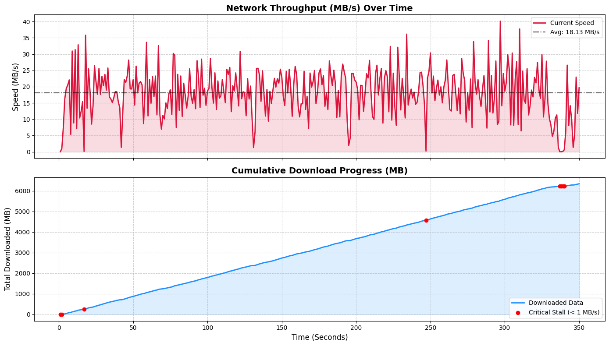

# downpour
A brutally fast, highly concurrent, multi-worker file downloader built in Go

---
### Build & Run
```bash
git clone "https://github.com/notblankz/downpour.git"
cd downpour/
go build -o downpour.exe

# Normal Download
.\downpour.exe "https://ash-speed.hetzner.com/1GB.bin"

# Enable Telemetry (Generates a CSV with telemetry data like speed/progress)
.\downpour.exe -tel "https://releases.ubuntu.com/24.04/ubuntu-24.04-desktop-amd64.iso"

# Generate HTTP Trace Logs (For deep network debugging):
.\downpour.exe -hl "https://example.com/file.zip"

# Show Help:
.\downpour.exe -h
```
---

### Current Status
Status: Functional & Structurally Sound ***(Achieved perfect SHA256 match on a 6.6GB Ubuntu ISO over a 12-worker pool)***
Current Throughput: Peaks at ***40+ MB/s***
Time Taken: ***350s***

Below is the raw telemetry visualization from the 6.6GB stress test

