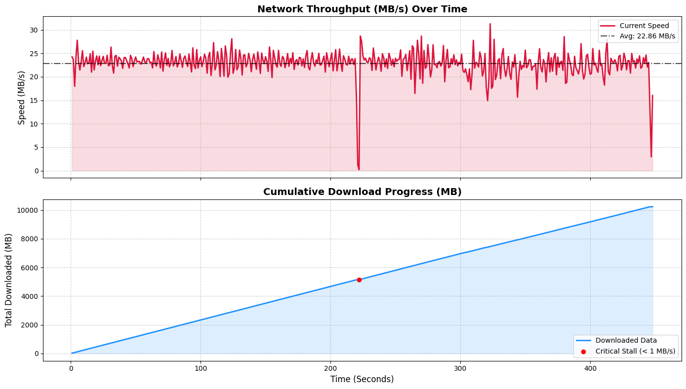
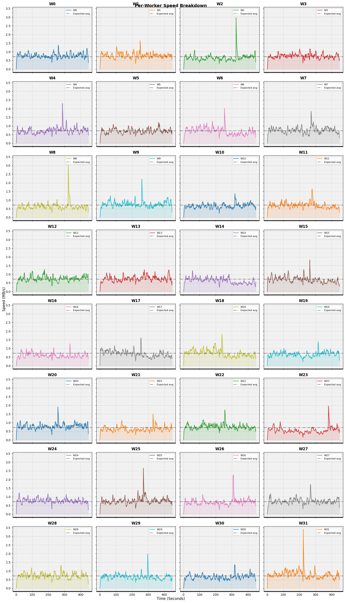

# downpour
A brutally fast, highly concurrent, multi-worker file downloader built in Go

---
### Build & Run

**Prerequisites:** Go 1.26.1, Make

Clone the repo:
```bash
git clone "https://github.com/notblankz/downpour.git"
cd downpour/
```

Build for your platform:

**Linux / macOS**
```bash
make linux-amd64    # Linux x86_64
make linux-arm64    # Linux ARM64
make darwin-amd64   # macOS Intel
make darwin-arm64   # macOS Apple Silicon
```

**Windows (via WSL or Git Bash)**
```bash
make windows-amd64  # Windows x86_64
make windows-arm64  # Windows ARM64
```

Or build all platforms at once:
```bash
make all
```

Binaries are output to the `builds/` directory.

---

**Usage:**
```bash
# Normal Download
./builds/downpour-linux-amd64 "https://ash-speed.hetzner.com/1GB.bin"

# Enable Telemetry
./builds/downpour-linux-amd64 -tel "https://sin-speed.hetzner.com/1GB.bin"

# Generate HTTP Trace Logs
./builds/downpour-linux-amd64 -hl "https://example.com/file.zip"

# Show Help
./builds/downpour-linux-amd64 -h
```

> On Windows use `.\builds\downpour-windows-amd64.exe` instead.

---

### Current Status
- Status: ***Implemented a Health Monitor go routine that restarts slow workers***
    - Monitor smoothened worker speeds per worker for stable restart decisions
    - Calculates the trimmed mean speed across all the workers (15% trim each side) to exclude outliers
    - Restart workers slower than 0.3x trimmed mean speed in hopes of it being routed better and can perform better
    - Skip restarts in final 2% of download to avoid TCP slow-start at tail
    - 5s grace period per worker to allow TCP slow-start ramp up of the worker before evaluating it's speed
    - Non-blocking restart signal via buffered chan struct{} size 1 - this is to prevent health monitor blocking on a busy worker
- Current Throughput:  ***10GB sustained download at 22.86 MB/s average***
- Test Environment:
    - Tested on local machine *(AMD Ryzen 7 250 + 16GB RAM + RTX 5060 Laptop GPU)*
    - Test download: `"https://sin-speed.hetzner.com/10GB.bin"`
- Time Taken: ***448.55s*** *(12.8s faster than before)*

Below is the raw Global telemetry visualization from the 10GB stress test


Below is the telemetry for download speeds of each worker
