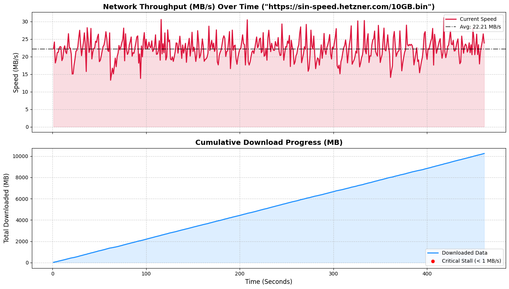
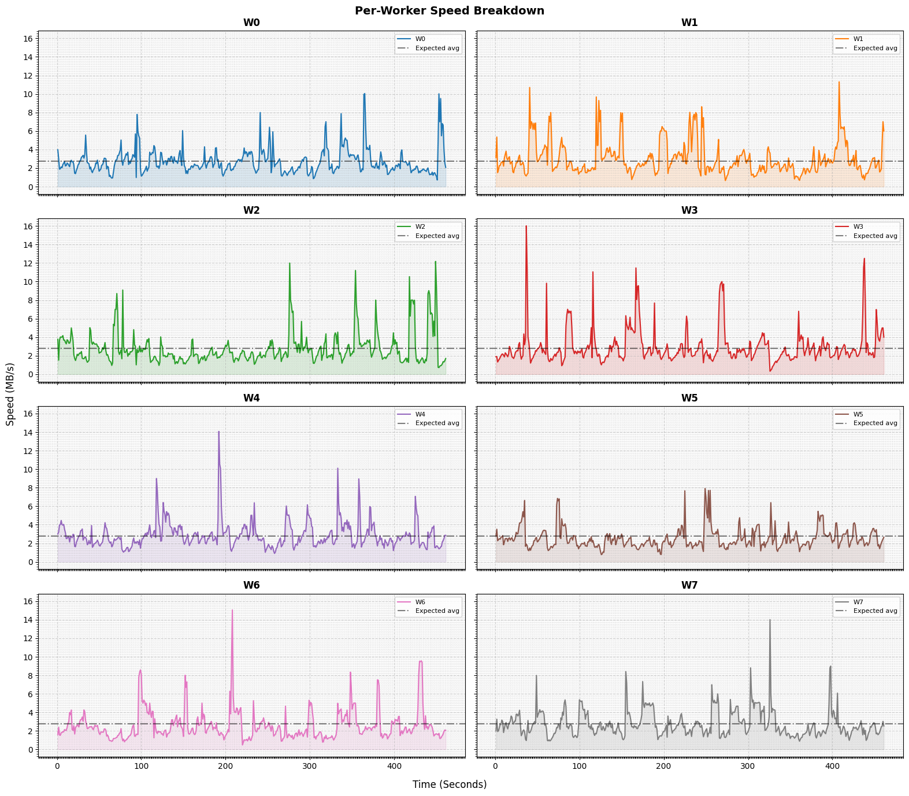

# downpour
A brutally fast, highly concurrent, multi-worker file downloader built in Go

---
### Build & Run
```bash
git clone "https://github.com/notblankz/downpour.git"
cd downpour/
go build -o downpour.exe

# Normal Download
.\downpour.exe "https://ash-speed.hetzner.com/1GB.bin"

# Enable Telemetry (Generates a CSV with telemetry data like speed/progress)
.\downpour.exe -tel "https://releases.ubuntu.com/24.04/ubuntu-24.04-desktop-amd64.iso"

# Generate HTTP Trace Logs (For deep network debugging):
.\downpour.exe -hl "https://example.com/file.zip"

# Show Help:
.\downpour.exe -h
```
---

### Current Status
- Status: Much lesser dips and peaks during the download, instead maintains a much more smooth graph *(less brutal sawtoothing)*
- Current Throughput:  ***10GB sustained download at 22.21 MB/s average***
- Test Environment:
    - Tested on local machine *(AMD Ryzen 7 250 + 16GB RAM + RTX 5060 Laptop GPU)*
    - Test download: `"https://sin-speed.hetzner.com/10GB.bin"`
- Time Taken: ***461.35s***

Below is the raw Global telemetry visualization from the 10GB stress test


Below is the telemetry for download speeds of each worker
